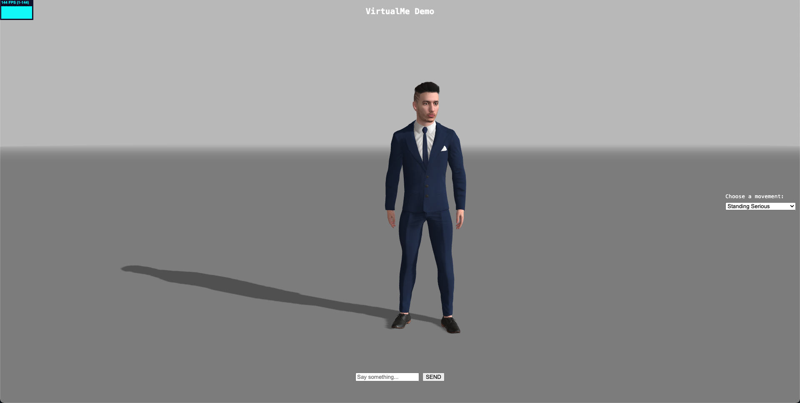

# VirtualMe 2.0

VirtualMe 2.0 is a 3D avatar demo application that allows you to interact with realistic avatars using various animations and movements.



## How to Launch the App

This is a static HTML/JavaScript application that uses Three.js for 3D graphics. You can launch it using any of the following methods:

### Option 1: Python HTTP Server (Recommended)
```bash
python3 -m http.server 8000
```
Then open your browser and go to: **http://localhost:8000**

### Option 2: Using npx serve
```bash
npx serve -s . -l 3000
```
Then open your browser and go to: **http://localhost:3000**

### Option 3: Using live-server (with auto-reload)
```bash
npx live-server --port=8080
```
Then open your browser and go to: **http://localhost:8080**

## Features

- **3D Avatar Display**: Realistic 3D avatars powered by Avaturn.me
- **Animation Controls**: Choose from various movements and poses including:
  - Standing poses (Chill, Serious, Straight)
  - Dance moves (Happy, Crazy, Rock, Win)
  - Action sequences (Fight combos, Kicks, Flips)
  - Character poses (Sassy, Egyptian God, Superman Landing)
- **Interactive Chat**: Send messages to interact with the avatar
- **Real-time Animation**: Smooth transitions between different movements

## Technology Stack

- **Three.js**: 3D graphics rendering
- **Avaturn.me**: Avatar system integration
- **Vanilla JavaScript**: Core application logic
- **HTML5/CSS3**: User interface

## Usage

1. Launch the application using one of the methods above
2. Use the "Choose a movement" dropdown on the right to select different animations
3. Type messages in the chat input at the bottom to interact with the avatar
4. Enjoy watching your avatar perform various movements and poses!
